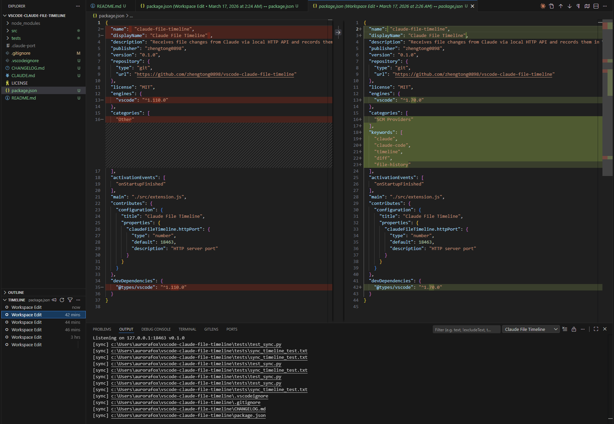
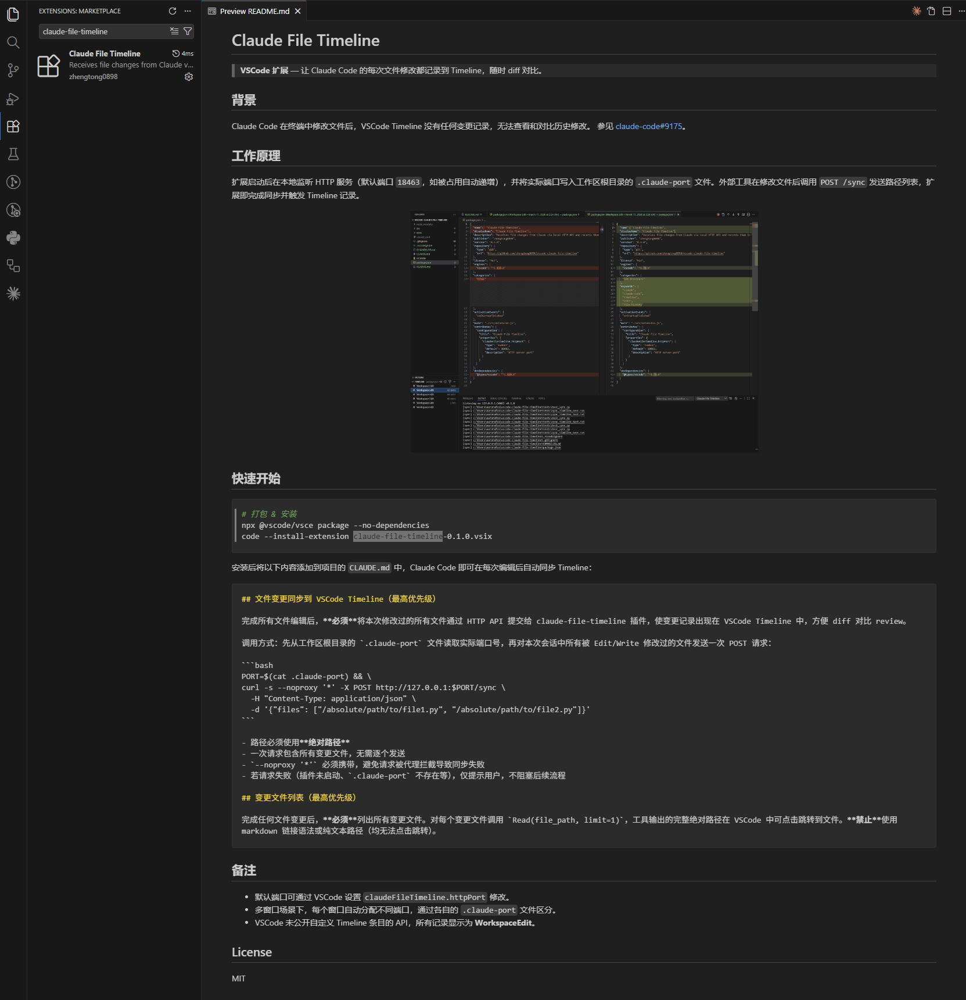

# Claude File Timeline

> **VSCode 扩展** — 让 Claude Code 的每次文件修改都记录到 Timeline，随时 diff 对比。

## 背景

Claude Code 在终端中修改文件后，VSCode Timeline 没有任何变更记录，无法查看和对比历史修改。
参见 [claude-code#9175](https://github.com/anthropics/claude-code/issues/9175)。

## 工作原理

扩展启动后在本地监听 HTTP 服务（默认端口 `18463`，如被占用自动递增），并将实际端口写入工作区根目录的 `.claude-port` 文件。外部工具在修改文件后调用 `POST /sync` 发送路径列表，扩展即完成同步并触发 Timeline 记录。

<p align="center">
  
</p>

## 快速开始

### 方式一：本地安装

```bash
# 克隆项目
git clone https://github.com/zhengtong0898/vscode-claude-file-timeline.git
cd vscode-claude-file-timeline

# 安装依赖
npm install

# 打包 & 安装
npx @vscode/vsce package --no-dependencies
code --install-extension claude-file-timeline-0.1.0.vsix
```

> 如果 VSCode 正在运行中，安装完成后需要按 `Ctrl + Shift + P`，输入 `Reload Window` 重启窗口以加载扩展。

### 方式二：从插件市场安装

在 VSCode 扩展市场搜索 **claude-file-timeline** 进行安装：

<p align="center">
  
</p>

安装后将以下内容添加到项目的 `CLAUDE.md` 中，Claude Code 即可在每次编辑后自动同步 Timeline：

````markdown
## 文件变更同步到 VSCode Timeline（最高优先级）

完成所有文件编辑后，**必须**将本次修改过的所有文件通过 HTTP API 提交给 claude-file-timeline 插件，使变更记录出现在 VSCode Timeline 中，方便 diff 对比 review。

调用方式：先从工作区根目录的 `.claude-port` 文件读取实际端口号，再对本次会话中所有被 Edit/Write 修改过的文件发送一次 POST 请求：

```bash
PORT=$(cat .claude-port) && \
curl -s --noproxy '*' -X POST http://127.0.0.1:$PORT/sync \
  -H "Content-Type: application/json" \
  -d '{"files": ["/absolute/path/to/file1.py", "/absolute/path/to/file2.py"]}'
```

- 路径必须使用**绝对路径**
- 一次请求包含所有变更文件，无需逐个发送
- `--noproxy '*'` 必须携带，避免请求被代理拦截导致同步失败
- 若请求失败（插件未启动、`.claude-port` 不存在等），仅提示用户，不阻塞后续流程

## 变更文件列表（最高优先级）

完成任何文件变更后，**必须**列出所有变更文件。对每个变更文件调用 `Read(file_path, limit=1)`，工具输出的完整绝对路径在 VSCode 中可点击跳转到文件。**禁止**使用 markdown 链接语法或纯文本路径（均无法点击跳转）。
````

## 备注

- 默认端口可通过 VSCode 设置 `claudeFileTimeline.httpPort` 修改。
- 多窗口场景下，每个窗口自动分配不同端口，通过各自的 `.claude-port` 文件区分。
- VSCode 未公开自定义 Timeline 条目的 API，所有记录显示为 **WorkspaceEdit**。

## License

MIT
